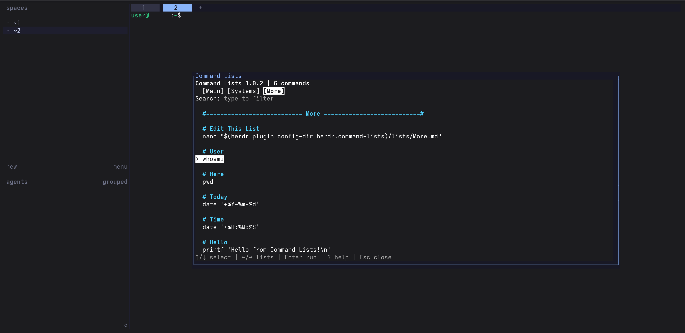
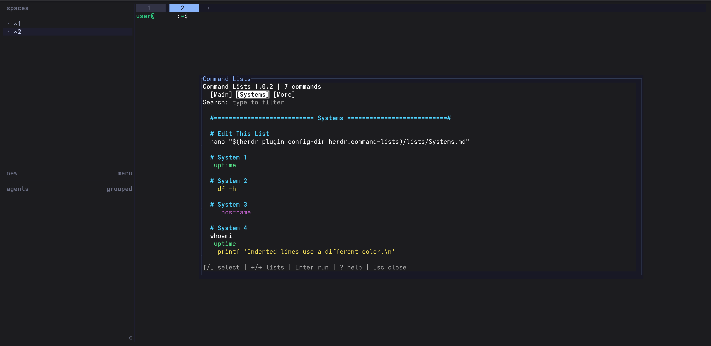

# Command Lists v1.0.2 — Herdr plugin for Linux & macOS

A small Herdr plugin that lets you browse and run commands from custom command lists.

Plugin ID: `herdr.command-lists`

## Preview





## Installation on Linux or macOS

Requirements:
- Herdr **0.9.0 or newer**
- Go **1.23.2 or newer**. This is the compatibility minimum, not a pinned build version.
  Builds use the locally installed Go toolchain (`GOTOOLCHAIN=local`), so a system with a newer Go version builds with that local version.

```sh
herdr --version
go version
```

### Install from GitHub

```sh
herdr plugin install c7zx/herdr-command-lists
```

### Install from a local checkout or downloaded ZIP

Extract the `.zip` archive into the directory where you want the plugin to remain installed. For example, local plugins can be kept under `~/.herdr-plugins/`. Do not install it from a temporary directory and move it afterward.

From the extracted or cloned project directory:

```sh
chmod +x install.sh uninstall.sh
./install.sh
```

### The installer:

1. Runs the tests with the locally installed Go toolchain.
2. Builds `command-lists`.
3. Checks for an existing local Command Lists installation and replaces it only after the new source builds successfully.
4. Links the plugin with Herdr.
5. Creates `Main.md`, `Systems.md`, and `More.md` only when no `.md` command lists already exist.
6. Copies `HELP.md` into the plugin config directory for local help.
7. Adds a `Ctrl+Y` Command Lists shortcut to `~/.config/herdr/config.toml` when that key is not already in use.

Existing command lists are preserved during a local reinstall. The installer uses no `sudo` and downloads nothing itself. The build sets `GOTOOLCHAIN=local`.

## Command lists

Show the plugin configuration directory:

```sh
herdr plugin config-dir herdr.command-lists
```

Command lists are stored in its `lists/` directory. Every `.md` file directly inside that directory appears as a tab.

Edit a command list:

```sh
nano "$(herdr plugin config-dir herdr.command-lists)/lists/Main.md"
```

A fresh installation starts with `Main.md`, `Systems.md`, and `More.md`.

Rules:

- Every non-empty line that does not begin with `#` is an executable command.
- Lines whose first visible character is `#` are displayed as colored section headings and cannot be selected or executed.
- Blank lines are displayed as spacing.
- Leading spaces can be used for visual indentation and color variation.
- List filenames become tab names, so short names display best.
- Command lists are re-read each time the popup opens, so editing them does not require rebuilding or restarting the plugin.

## Controls

- `Up`: select upward; wraps from the first command to the last command.
- `Down`: select downward; wraps from the last command to the first command.
- `Left`: switch to the previous list; wraps from the first tab to the last tab.
- `Right`: switch to the next list; wraps from the last tab to the first tab.
- `Ctrl+Space`: jump to the first command in the next `#` section; wraps back to the first section.
- Type: filter commands case-insensitively. Matching section headings remain visible.
- `Backspace`: edit the search query.
- `Ctrl+U`: clear the search query.
- `Enter`: run the selected command in the original Herdr pane.
- `?`: open/close the built-in help view.
- `Esc` or `Ctrl+C`: close Command Lists.

No command is selected when the popup first opens. `Down` starts at the first command and `Up` starts at the last command. The visible list scrolls only when the selection reaches its edge.

Before running a selected command, Command Lists sends `Ctrl+E` and `Ctrl+U` to clear unfinished input. This is intended for a normal single-line shell prompt with standard Emacs-style editing keys; editors, multiline continuation prompts, and Vi/custom shell bindings can interpret those keys differently.

## Shortcut

The local installer adds this block when `Ctrl+Y` is available:

```toml
# Command Lists shortcut.
# Change "ctrl+y" to another Herdr key (for example "prefix+y") to customize it.
[[keys.command]]
key = "ctrl+y"
type = "plugin_action"
command = "herdr.command-lists.toggle"
description = "Command Lists"
```

Herdr reads the configuration from `~/.config/herdr/config.toml` on Linux and macOS unless `HERDR_CONFIG_PATH` overrides it.

Reload after manual config changes:

```sh
herdr server reload-config
```

## Reinstall or update a local copy

There is no separate updater. Extract or clone the newer release into its own permanent directory and run its `install.sh`.

The installer tests and builds the new source before removing an existing local Command Lists installation. The `lists/` directory is preserved, and starter lists are not added when `.md` lists already exist.

Do not extract a newer release inside the currently installed plugin directory.

## Uninstall

Run `uninstall.sh` from outside the installed plugin directory. The uninstaller removes the Command Lists shortcut, unlinks the plugin, removes generated plugin configuration, and keeps the `lists/` directory with your `.md` files.

If the plugin source is inside `~/.herdr-plugins/`, the source directory is removed as well. Herdr config backups are kept.

## Security

- There are no third-party Go modules, telemetry, network clients, background services, or daemons.
- The local install and uninstall scripts use no `sudo` and download nothing.
- Commands and displayed section headings reject invalid UTF-8, control characters, ANSI/escape sequences, tabs, Unicode bidi/format characters, zero-width characters, and Unicode line/paragraph separators.
- The same command validation runs again immediately before `herdr pane run`.
- Command-list files must be regular files; symbolic links and special files are rejected.
- The plugin configuration directory and `lists/` directory must be real directories and must not be symbolic links.
- Plugin configuration directories are hardened to `0700`; generated starter lists and installed `HELP.md` use `0600`.
- At most 128 command lists are loaded, and each list is limited to 1 MiB.
- Bracketed paste input is ignored so pasted newlines cannot accidentally execute the selected command.
- No `sh -c` is used by the plugin when submitting a command. The selected text is passed as a single argument to `herdr pane run`.
- Command-list files intentionally contain executable input. A dangerous command stored there remains dangerous and runs after you select it and press Enter.

See [CHANGELOG.md](CHANGELOG.md) for the changes in v1.0.2 and [LICENSE](LICENSE) for the MIT license.
